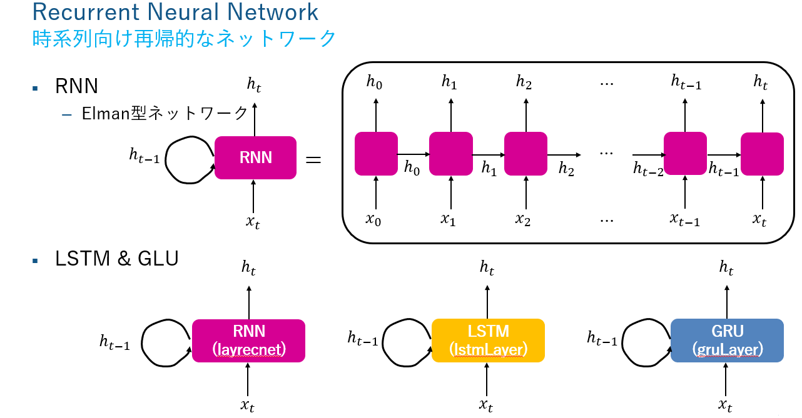
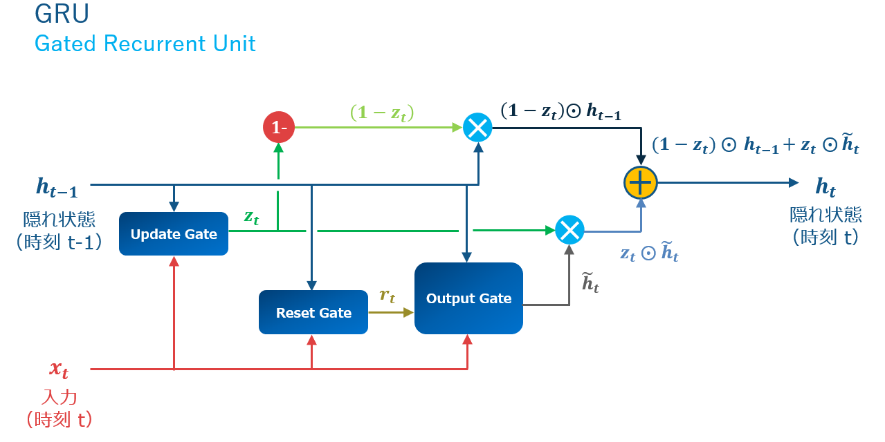
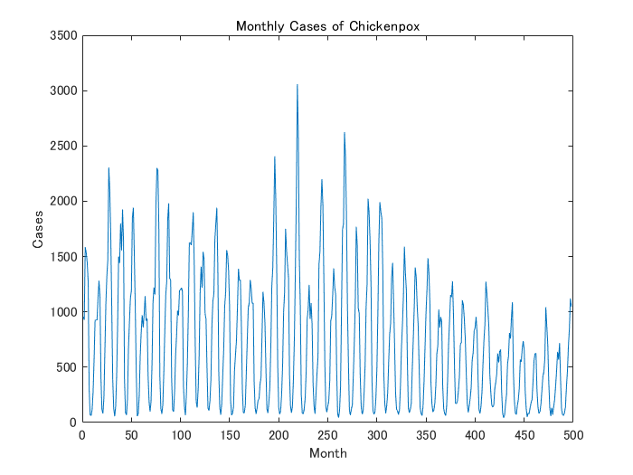
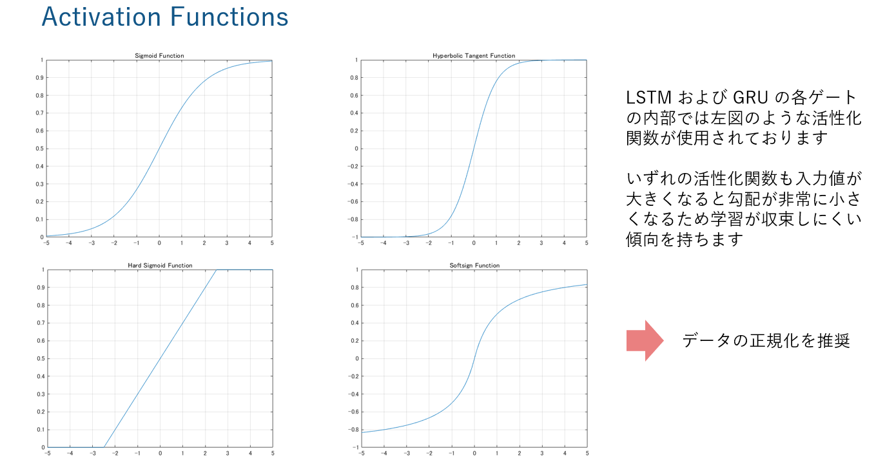
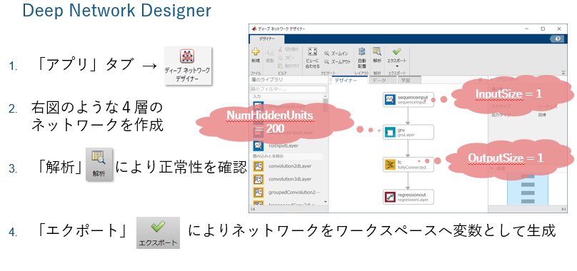
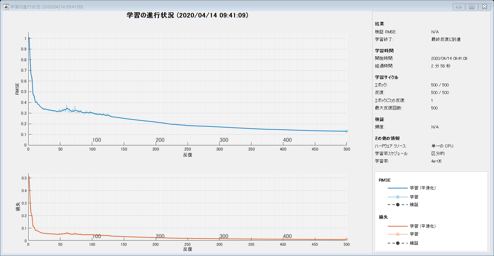
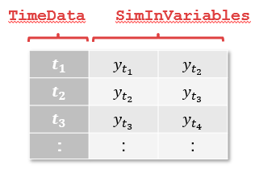

# GRU層を含んだニューラルネットワークによる水痘発生件数推移モデルの構築
# はじめに


当例題は、41.5年分の水痘患者数を収めた MATファイル「chickenpox_dataset.mat」にあるデータに対して、再帰的なニューラルネットワーク向けの層の１つ GRU (Gated Recurrent Unit) を適用して予測モデルを構築します。尚、当例題は Deep Learning Toolbox に付随する例題の１つ「[Time Series Forecasting Using Deep Learning](https://www.mathworks.com/help/deeplearning/examples/time-series-forecasting-using-deep-learning.html)」に基づいております


# GRU について


GRU は、再帰的なニューラルネットワークを表現する層の一種で  LSTM (Long Short Term Memory) よりシンプルな構造を持ちながら Elman 型ネットワークとは違い、現在時刻  からの遠近に伴って重みを変えているという特徴を持ちます


  





  
  





  
# 1: MAT-ファイルからデータをインポート


月次の水痘患者数を収めた「chickenpox_dataset.mat」からデータをインポートします


```matlab:Code
matobj = matfile('chickenpox_dataset.mat');
RawDataCell = matobj.chickenpoxTargets;
RawData = [RawDataCell{:}]';
T = 1:numel(RawData);
```

# 2: 水痘患者発生件数を月次で可視化


毎月の水痘患者数をグラフ表示します


```matlab:Code
figure
plot(RawData)
xlabel("Month")
ylabel("Cases")
title("Monthly Cases of Chickenpox")
```




# 3: データの正規化
  





  
  


Statistics and Machine Learning Toolbox が提供する「zscore」関数を利用すると平均を引いて標準偏差で割るという正規化の作業を１行で済ませることができます


```matlab:Code
[nData, mu, sigma] = zscore(RawData);
```

# 4: データの分割


前半の約90%を学習用のデータとして、後半の約10%を検証用のデータとして分割します


```matlab:Code
NumTrain = floor(0.9*numel(nData));
TrainData = nData(1:NumTrain+1);
TestData = nData(NumTrain+1:end);
```

# 5: GRU ネットワークの構築
  


「アプリ」タブを選択し、一覧の中にある「Deep Network Designer」を選びます。そして、下図のようなネットワークを構築します





コマンドラインの場合、次のように書くと等価なネットワークを作成することができます。Deep Network Designer には作成したネットワークに対して MATLAB コードを生成する機能が提供されております


```matlab:Code
layers_1 = [ ...
    sequenceInputLayer(1)
    gruLayer(200)
    fullyConnectedLayer(1)
    regressionLayer];
```

# 6: 学習オプションの設定

```matlab:Code
options = trainingOptions('adam', ...
    'MaxEpochs',500, ...
    'GradientThreshold',1, ...
    'InitialLearnRate',0.005, ...
    'LearnRateSchedule','piecewise', ...
    'LearnRateDropPeriod',125, ...
    'LearnRateDropFactor',0.2, ...
    'Verbose',0, ...
    'Plots','training-progress');
```

  
# 7: 事前学習済み学習器を作成

```matlab:Code
%% Train GRU network
XTrain = TrainData(1:end-1)'; % transpose to make the vector horizontally
YTrain = TrainData(2:end)';

% tic;
net = trainNetwork(XTrain,YTrain,layers_1,options);
```





```matlab:Code
% toc; % Elapsed time is 178.584624 seconds
save('TrainedGRUNetwork', 'net')
net0 = net; % backup the trained network for Simulink demo
```

# 8: 50か月の発生件数推移を再帰的に予想 (MATLAB編)


Simulink によるシミュレーションの実行の前に、MATLAB 上で再帰的に発生件数を推定します。SeriesNetworkクラス「net」のメソッドの１つ「predictAndUpdateState」は、推定値を使ってネットワークを更新する機能を提供します


```matlab:Code
NumTest = numel(TestData) - 1;
YPred = zeros(1, NumTest);

for n = 1:NumTest
    [net, YPred(n)] = predictAndUpdateState(net, TestData(n));
end

RMSE = sqrt(mean((YPred-TestData(2:end)').^2));
disp(['RMSE = ', num2str(RMSE)])
```


```text:Output
RMSE = 0.3298
```

  


推定値の時系列「YPred」は、正規化された値になっていますので元のスケールに戻し「rYPred」とします


```matlab:Code
rYPred = sigma .* YPred + mu;
```

# 9: MATLABによる推移予想の可視化

```matlab:Code
figure; axH = axes;
pH1 = plot(axH, T, RawData);
hold on
pH2 = plot(axH, T(NumTrain+1:end),[RawData(NumTrain+1) rYPred],".-");
fH = fill(axH, T([1,NumTrain, NumTrain, 1]), [repmat(axH.YLim(1),1,2), repmat(axH.YLim(2),1,2)], [.9, .9, .9]);
uistack(fH,"bottom")
hold off
xlabel("Month")
ylabel("Cases")
title("Forecast the number of chickenpox cases using GRU")
legend([pH1, pH2, fH], ["Observation" "Forecast", "Training Period"])
```


# 10: 50か月の発生件数推移を再帰的に予想 (Simulink編)


次に、等価な再帰的推定を Simulink 上で実施します。事前学習済みのネットワークを初期化し、Simulink モデルへ時系列データを入力変数として渡すために時刻データ配列「TimeData」および部分時系列配列「SimInVariables」を作成します





```matlab:Code
net = net0; % reset the pre-trained network

TimeData = T(NumTrain+1:end-1).';
SimInVariables = [TestData(1:end-1), TestData(2:end)];
```


そして、「set_param」コマンドを使ってソルバーやステップサイズなどを設定した後に「run」を実行するとシミュレーションが開始します


```matlab:Code
mdl = 'recursive_gru_update';
open_system(mdl);

set_param(mdl, 'Solver', 'FixedStepAuto');
set_param(mdl, 'FixedStep', '1');
set_param(mdl, 'StartTime', num2str(TimeData(1)));
set_param(mdl, 'StopTime',  num2str(TimeData(end)));

% Run simulation
out = sim(mdl);
```

# 11: Simulink による推移予想の可視化


MATLAB の時と同様に Simulink モデル を介した推移予測を可視化します


```matlab:Code
figure; axH2 = axes;
pH3 = plot(axH2, T, RawData);
hold on
pH4 = plot(axH2, T(NumTrain+1:end),[RawData(NumTrain+1); out.ScopeOut.signals(1).values],".-");
fH2= fill(axH2, T([1,NumTrain, NumTrain, 1]), [repmat(axH2.YLim(1),1,2), repmat(axH2.YLim(2),1,2)], [.9, .9, .9]);
uistack(fH2,"bottom")
hold off
xlabel("Month")
ylabel("Cases")
title("Forecast the number of chickenpox cases using GRU")
legend([pH3, pH4, fH2], ["Observation" "Forecast", "Training Period"])
```


# 12: MATLAB と Simulink の一致性検証

```matlab:Code
isequal(out.ScopeOut.signals(1).values, rYPred.')
```


```text:Output
ans = 
   1

```

